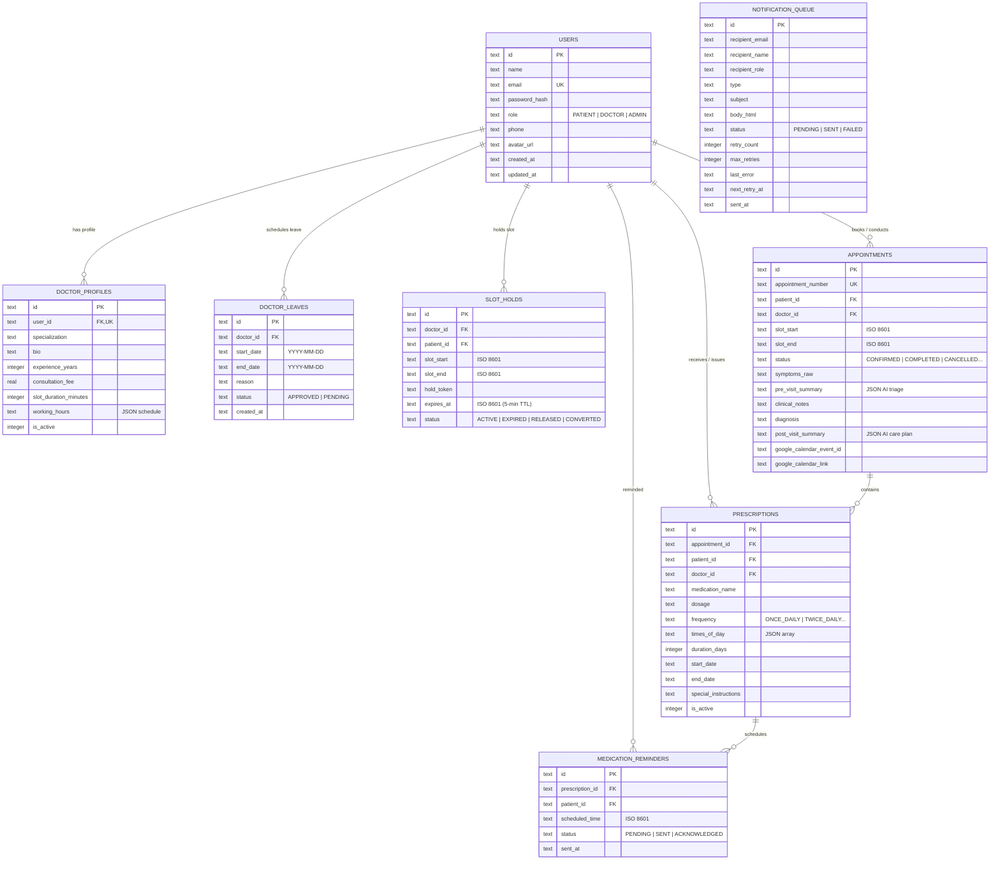

# CareFlow Health - Database Schema & ER Diagram

The database utilizes SQLite with WAL (Write-Ahead Logging) and strict foreign key constraints enabled for high performance, transactional safety, and concurrent reads/writes.

